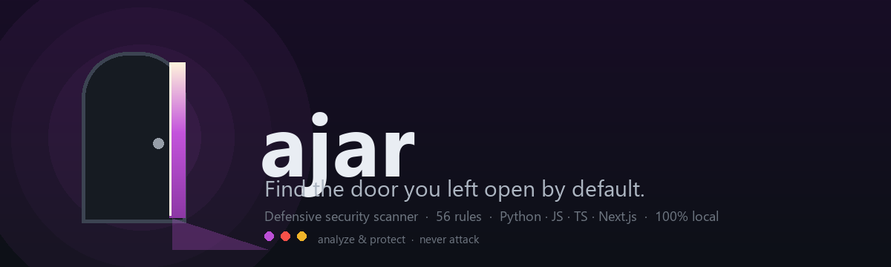
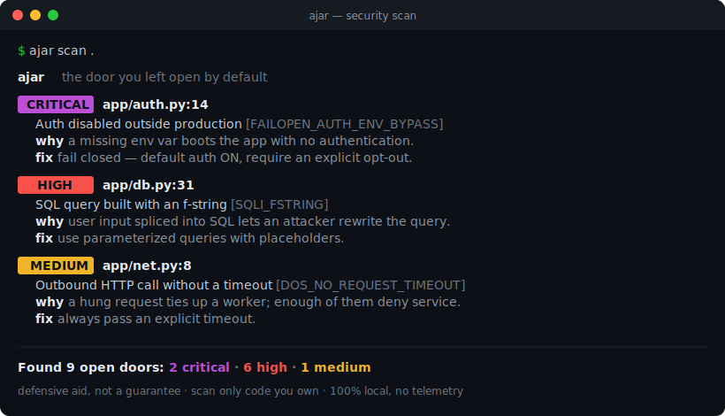

<p align="center">
  
</p>

<p align="center">
  <b>A defensive scanner for <i>fail-open logic</i>, <i>insecure defaults</i>, and <i>web vulnerabilities</i> — that understands your code and explains every fix.</b>
</p>

<p align="center">
  
  
  
  
  
  
  
</p>

<p align="center">
  
</p>

---

Most secret scanners look for the credential you **put in** (`API_KEY = "sk-123"`).

**ajar looks for the door you left open by default** — code that silently runs
*insecure* when a config is missing, an environment name differs, or an error
gets swallowed. No exploit required: the default *is* the vulnerability.

```python
if os.getenv("APP_ENV") != "production":
    require_auth = False        # 🚪 unset/typo'd env → auth is OFF in prod

requests.get(url, verify=False) # 🚪 every request open to a man-in-the-middle

try:
    return check_permission(user)
except Exception:
    return True                 # 🚪 an error becomes a free pass
```

Nobody flags these well. That's the gap ajar fills.

## What it scans

Point ajar at a web app or SaaS backend and it flags five families of risk:

| Category | Examples |
|---|---|
| 🚪 **fail-open** *(flagship)* | auth disabled by a missing env var, `verify=False` defaults, errors that grant access |
| ⚙️ **insecure-defaults** | `DEBUG=True`, wildcard CORS, `0.0.0.0` binds, weak hashes, insecure cookies |
| 💉 **injection** *(web)* | SQL injection, command injection, XSS, SSRF, path traversal, unsafe deserialization, SSTI, open redirect |
| 🌊 **denial-of-service** | missing timeouts, catastrophic-backtracking regex (ReDoS), decompression bombs, user-controlled regex |
| 🔑 **secrets** | hardcoded AWS/GitHub/Google/Stripe/OpenAI keys, private keys, tokens, credentials in URLs, **plus entropy-based detection** for random secrets that match no known pattern |

Works on **Python, JavaScript, TypeScript, and TSX (React/Next.js)**. Every rule
is defensive — it explains the attack and the safe fix, and never produces an exploit.

### It actually understands your code

With the optional parser engine (`pip install ajar[full]`), ajar uses
[tree-sitter](https://tree-sitter.github.io/) — the same parser GitHub uses — to
understand the real structure of your code. That means:

- A keyword mentioned in a **comment or a string never triggers a false alarm** —
  in Python *and* in your TypeScript/Next.js files.
- Secrets are still caught **inside** strings (that's where they hide), while
  code checks are only applied to real code.
- **Data-flow (taint) tracking** follows user input across variables into a
  dangerous sink — catching exploitable injections that single-line patterns miss
  (e.g. `q = build(request.args['id']); cursor.execute(q)`).

No parsers installed? ajar falls back to fast pattern scanning and still works —
so it's "pro by default" without ever being fragile.

## 🤖 Use it with your AI assistant (or any AI assistant)

ajar is built to **pair with an AI coding assistant** so you don't just *find*
vulnerabilities — you *fix* them. A scanner tells you what's wrong; your AI
applies the fix; ajar confirms it's closed. Together they close the loop.

ajar ships as a **AI-assistant skill** (in [`skills/ajar/`](skills/ajar/SKILL.md)).
Install it and just say:

> **"Use the ajar skill on my project."**

Your AI assistant will then:

1. **Scan** your code with ajar (`ajar scan . --format json`).
2. **Explain** every finding — what it is, how it's attacked, how to fix it.
3. **Fix** each issue with you, worst-first, making minimal correct changes.
4. **Re-scan** until the project is clean.

Every finding already carries a machine-readable `why` and `fix` (see
`--format json`), so any assistant can act on the results — no special mode
needed. It stays defensive throughout: it fixes and protects, never attacks.

> A clean scan is a strong result, not a guarantee — ajar catches common,
> detectable issues, not business-logic or design flaws. Keep a human in the loop
> for anything security-critical.

## Why ajar is different

- 🎯 **Fail-open first.** The flagship category is *fail-open logic*, not just secrets — the misconfigurations behind real breaches (open buckets, auth-less admin panels, debug in prod).
- 🎓 **It teaches.** Every finding explains **how an attacker exploits it** and **exactly how to fix it**, with references. You learn while you scan.
- 🧠 **Understands code, not just text.** An optional tree-sitter engine parses Python/JS/TS/TSX so comments and strings never cause false positives — the difference between a serious tool and a noisy one.
- 🔒 **Trust by design.** 100% local. **Zero telemetry.** Your code never leaves your machine. Rules are plain, readable YAML you can audit in `ajar/rules/`.
- ⚡ **Light and robust.** Tiny core (one dependency); the parser engine is an optional extra, and ajar degrades gracefully to pattern scanning without it. Terminal, JSON, and SARIF output for CI.

### How it compares

ajar isn't trying to replace the big scanners — it fills a gap next to them.

| | ajar | secret scanners | big SAST platforms |
|---|:---:|:---:|:---:|
| Fail-open / insecure-default logic | ✅ focus | ⚠️ partial | ⚠️ partial |
| Comment/string-aware (few false positives) | ✅ tree-sitter | ⚠️ | ✅ |
| Explains attack **and** fix per finding | ✅ | ❌ | ⚠️ |
| Runs 100% locally, zero telemetry | ✅ | ⚠️ | ❌ (often cloud) |
| Transparent rules you can read/edit | ✅ YAML | ⚠️ | ⚠️ |
| Setup time | seconds | seconds | hours |

## Install

```bash
pip install "ajar-scanner[full]"   # recommended: includes the tree-sitter engine
pip install ajar-scanner           # lightweight: pattern scanning only
# the command is `ajar` either way. Or from source:
git clone https://github.com/ignaciovalderrama999-dotcom/ajar && cd ajar && pip install ".[full]"
```

## Usage

```bash
ajar scan .                       # scan the current project
ajar scan path/to/file.py         # scan one file
ajar scan examples/vulnerable_webapp.py  # demo: SQLi, XSS, SSRF, RCE, path traversal
ajar scan . --min-severity high   # only show high+ findings
ajar scan . --exclude tests --exclude '*.min.js'  # skip paths (repeatable)
ajar scan . --format json         # machine-readable output
ajar scan . --format sarif        # GitHub code scanning
ajar scan . --write-baseline      # record current findings as accepted
ajar scan . --baseline            # then only show NEW findings
ajar rules                        # list every rule ajar checks
ajar rules --format md            # the full rule catalog (see RULES.md)
```

The full catalog of all rules, with the attack and the fix for each, lives in
**[RULES.md](RULES.md)** (generated by `ajar rules --format md`).

### Example

```console
$ ajar scan examples/vulnerable_config.py

 CRITICAL  examples/vulnerable_config.py:16:5
   Auth disabled outside production  [FAILOPEN_AUTH_ENV_BYPASS]
   Authentication is switched off based on an environment name.
   code: require_auth = False
   why: If the env var that flips this is missing or misspelled in production,
        the app boots wide open with no authentication. The default IS the bug.
   fix: Fail closed — default auth to ON and require an explicit, logged opt-out.
   ref: https://owasp.org/Top10/A05_2021-Security_Misconfiguration/

Found 9 open doors: 2 critical · 6 high · 1 medium
```

## Configure it once

Drop a `.ajar.yml` in your project root and stop repeating flags (CLI flags
still override it). See [`.ajar.yml.example`](.ajar.yml.example):

```yaml
min_severity: low
fail_on: high
exclude:
  - tests
  - "*.min.js"
disable:
  - DEFAULT_BIND_ALL_INTERFACES
```

## Adopt it gradually with a baseline

Got an existing codebase with findings you can't fix today? Record them once and
let ajar flag only what's **new** from then on:

```bash
ajar scan . --write-baseline   # accept today's findings (.ajar-baseline.json)
ajar scan . --baseline         # from now on, only NEW issues fail the build
```

## Use it in CI

ajar returns a non-zero exit code when it finds an issue at or above
`--fail-on` (default: `medium`), so it drops straight into any pipeline. Add a
step to your GitHub Actions workflow:

```yaml
- run: pip install "ajar-scanner[full]"
- run: ajar scan . --fail-on high
```

### pre-commit

ajar ships a [pre-commit](https://pre-commit.com) hook — add it to
`.pre-commit-config.yaml`:

```yaml
repos:
  - repo: https://github.com/ignaciovalderrama999-dotcom/ajar
    rev: v0.1.0
    hooks:
      - id: ajar
```

### Docker

No local install needed:

```bash
docker run --rm -v "$PWD:/src" ghcr.io/ignaciovalderrama999-dotcom/ajar scan /src
```

## Suppressing a finding

When something is a deliberate, reviewed exception, silence it inline:

```python
DEBUG = True  # ajar:ignore                    # silence every rule on this line
DEBUG = True  # ajar:ignore DEFAULT_DEBUG_ON    # silence one specific rule
```

## Writing your own rules

Rules are transparent YAML — no hidden logic. Drop a file in `ajar/rules/` (or
point `--rules` at your own directory):

```yaml
rules:
  - id: MY_RULE
    name: Short human name
    severity: high          # info | low | medium | high | critical
    category: fail-open
    message: One-line description of the issue.
    pattern: '(?i)dangerous_setting\s*=\s*True'   # a Python regex
    why: How an attacker abuses this.
    fix: How to close the door.
    references:
      - https://owasp.org/...
    extensions: [".py"]    # optional: only these file types
    context: code          # optional: code (default) | string | any
```

`context` controls where a match counts once the tree-sitter engine knows code
from comments and strings: `code` ignores comments **and** strings (most rules),
`string` allows matches inside string literals (e.g. a dangerous regex),
`any` never suppresses (secrets — a leaked key counts anywhere).

## Ethics: analyze and protect, never attack 🛡️

ajar is a **defensive** tool, on purpose. It **points at risk and explains the
fix** — it never generates exploits, payloads, or offensive tooling, and it
never connects to or probes any remote system. Its whole job is to help you
close doors before someone else finds them open. That principle is not up for
negotiation, and it guides every rule we add.

## Legal & responsible use ⚖️

- **Use it only on code you own or are authorized to review.** See the full
  [Acceptable Use Policy](ACCEPTABLE_USE.md).
- **It is an aid, not a guarantee.** A clean scan does not mean your app is
  secure. See the [Disclaimer & Limitation of Liability](DISCLAIMER.md).
- **Provided "AS IS", no warranty, no liability** — standard [Apache 2.0](LICENSE)
  terms. You are responsible for how you use it.
- **Found a bug in ajar itself?** See [SECURITY.md](SECURITY.md).
- **Forks & modified copies are the modifier's responsibility, not the
  author's.** Only the official repository is endorsed; the name "ajar" may not
  be used to promote modified versions. Details in the [DISCLAIMER](DISCLAIMER.md).

By using ajar you accept the [DISCLAIMER](DISCLAIMER.md) and
[Acceptable Use Policy](ACCEPTABLE_USE.md). If you do not agree, do not use it.

## FAQ

**Isn't this just another secret scanner?**
No. Secret scanners find the credential you *committed*. ajar's flagship category
is *fail-open logic* — code that runs insecure when a config is missing or wrong.
That's a different, largely uncovered class of bug.

**Will it catch every vulnerability?**
No tool does, and ajar is honest about it: it's a fast, heuristic first line of
defense, not a replacement for a real audit. See the [DISCLAIMER](DISCLAIMER.md).

**Does my code leave my machine?**
Never. ajar runs 100% locally, reads files only, and sends nothing anywhere.
No telemetry, no account, no network calls.

**How do I silence a false positive?**
Inline `# ajar:ignore`, a `disable:` list in `.ajar.yml`, or a `--baseline`.

**Can I use it to attack a site?**
No. ajar analyzes local source and never touches remote systems or generates
exploits. It is defensive by design — see [ACCEPTABLE_USE.md](ACCEPTABLE_USE.md).

## Roadmap

- [x] `--baseline` to accept existing findings and only flag new ones
- [x] pre-commit hook and Docker image
- [x] Denial-of-service rule category
- [x] Structural (tree-sitter) engine so comments/strings never false-positive
- [ ] Deeper structural rules (track a value across lines, e.g. template-literal SQLi through a variable)
- [ ] More languages (Go, Java, PHP, Ruby — tree-sitter already supports 100+)
- [ ] Publish to PyPI

## Contributing

New rules are the best contribution — especially fail-open patterns you've seen
in the wild. Keep every rule **defensive, explainable, and referenced**. PRs and
issues welcome.

## License

Apache License 2.0 © 2026 Ignacio Valderrama. See [LICENSE](LICENSE) and [NOTICE](NOTICE).
